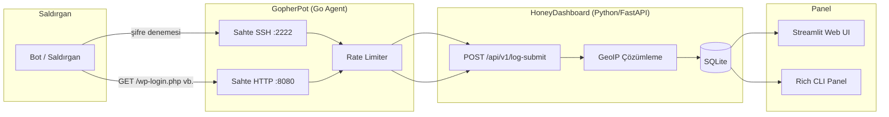

# 🕸️ GopherPot + HoneyDashboard

Hafif, modüler bir **honeypot izleme sistemi**. Go ile yazılmış düşük kaynaklı
ajanlar (`GopherPot`) sahte SSH ve HTTP servisleri sunarak saldırganları/botları
çeker ve yakaladığı kimlik bilgisi denemelerini merkezi bir Python/FastAPI
backend'e (`HoneyDashboard`) raporlar. Veriler GeoIP ile zenginleştirilir ve
Streamlit (web) veya Rich (terminal) panelinde canlı olarak izlenebilir.

>  **Güvenlik notu:** Bu proje eğitim/portfolyo amaçlıdır. Gerçek bir ağda
> çalıştırmadan önce "İzolasyon ve Güvenlik" bölümünü okuyun. Bir honeypot'un
> kendisi güvenlik açığı haline gelmemeli.

---

##  Mimari



İki ajan (SSH/HTTP) de gelen her denemeyi `LogEntry` JSON'una çevirip
backend'e POST eder. Backend o an ayakta değilse ajan veriyi
`fallback_logs.jsonl` dosyasına yazar, veri kaybolmaz.

---

##  Klasör Yapısı

```
gopherpot-project/
├── gopherpot/              # Go honeypot ajanı
│   ├── main.go
│   ├── sshhoneypot.go      # Gerçek SSH protokolüyle şifre yakalama
│   ├── httphoneypot.go     # Sahte /admin, /wp-login.php, .env vb.
│   ├── reporter.go         # Backend'e POST + fallback dosya
│   ├── ratelimiter.go      # IP başına flood koruması
│   ├── config.go
│   ├── go.mod
│   └── Dockerfile
├── honeydashboard/          # Python backend + panel
│   ├── main.py             # FastAPI: /api/v1/log-submit + analiz endpoint'leri
│   ├── database.py         # SQLAlchemy modeli (SQLite)
│   ├── geoip.py            # ip-api.com veya MaxMind GeoLite2
│   ├── dashboard.py        # Streamlit web paneli
│   ├── cli_dashboard.py    # Rich tabanlı terminal paneli
│   ├── requirements.txt
│   ├── Dockerfile
│   └── Dockerfile.dashboard
├── docker-compose.yml
└── README.md
```

---

##  Kurulum

### Seçenek A — Docker (önerilen)

```bash
docker compose up --build
```

- `honeydashboard-api` → http://localhost:8000 (Swagger: `/docs`)
- `honeydashboard-ui`  → http://localhost:8501 (Streamlit)
- `gopherpot`          → SSH `:2222`, HTTP `:8080`

Gerçek 22/80 portlarını kullanmak istersen, host'ta `iptables`/NAT ile
yönlendirme yap (konteyneri doğrudan root olarak 22'de dinletmek yerine):

```bash
sudo iptables -t nat -A PREROUTING -p tcp --dport 22 -j REDIRECT --to-port 2222
```

> Bunu yaparsan **gerçek SSH erişimini başka bir porta** (örn. 2200) taşımayı unutma,
> yoksa sunucuna kendi erişimini kaybedersin!

### Seçenek B — Manuel

```bash
# Backend
cd honeydashboard
python3 -m venv venv && source venv/bin/activate
pip install -r requirements.txt
uvicorn main:app --reload

# Dashboard (yeni terminal)
streamlit run dashboard.py
# veya terminal seviyorsan:
python cli_dashboard.py

# Go ajanı (yeni terminal, full internet erişimi olan bir makinede)
cd gopherpot
go mod tidy        # golang.org/x/crypto/ssh'ı indirir
go run .
```

---

##  İzolasyon ve Güvenlik (önemli)

1. **Honeypot'u gerçek sistemden izole et.** Ayrı bir Docker container, ayrı bir
   kullanıcı (`nobody`), mümkünse ayrı bir VM/VDS kullan. Honeypot'un kendisi
   asla gerçek dosya sistemine, gerçek SSH'a veya gerçek veritabanlarına erişim
   yolu olmamalı.
2. **Asla gerçek erişim verme.** `PasswordCallback` ve `PublicKeyCallback` her
   zaman hata döndürür — saldırgana hiçbir zaman gerçek bir shell/kanal açılmaz.
3. **Rate limiting** her iki serviste de aktif (`ratelimiter.go`), böylece tek
   bir IP'den flood saldırısı kaynakları tüketemez.
4. **Body/istek boyutu sınırlı** (`io.LimitReader`), büyük payload'larla bellek
   şişirme saldırısı engellenir.
5. Bu sistemi **public internet'e açık** bir sunucuda çalıştırıyorsan, bunun
   "an meselesi taranacağını" bil — bu zaten amaç, ama izolasyon kuralına
   uyduğundan emin ol.

---

##  GeoIP Notu

Varsayılan backend `ip-api.com`'un ücretsiz, key gerektirmeyen endpoint'i
(~45 istek/dk sınırı var). Daha güvenilir/limitsiz/offline kullanım için:

```bash
pip install geoip2
# MaxMind hesabı aç, ücretsiz lisans key'i al, GeoLite2-City.mmdb indir
export GEOIP_BACKEND=maxmind
export GEOLITE2_DB_PATH=./GeoLite2-City.mmdb
```

(Not: MaxMind 2024'ten itibaren anonim/key'siz indirmeyi kapattı, ücretsiz hesap
açman gerekiyor.)

---

## 📊 API Özeti

| Endpoint | Metod | Açıklama |
|---|---|---|
| `/api/v1/log-submit` | POST | Ajanların log gönderdiği ana endpoint |
| `/api/v1/logs` | GET | Son N log kaydı |
| `/api/v1/stats/summary` | GET | Toplam/tekil/SSH/HTTP sayıları |
| `/api/v1/stats/top-passwords` | GET | En çok denenen şifreler |
| `/api/v1/stats/top-countries` | GET | Ülkelere göre saldırı sayısı |
| `/health` | GET | Sağlık kontrolü |

Tam interaktif dokümantasyon için backend ayaktayken `http://localhost:8000/docs`.

---

##  Hızlı Test (ajan olmadan)

Backend'i ayağa kaldırdıktan sonra, gerçek bir saldırgan simüle edebilirsin:

```bash
curl -X POST http://localhost:8000/api/v1/log-submit \
  -H "Content-Type: application/json" \
  -d '{"attacker_ip":"203.0.113.42","service_type":"SSH","username":"root","payload":"123456","node_name":"test"}'
```

---

##  Yol Haritası / Geliştirme Fikirleri

- [ ] Çoklu ajan desteği için `node_name` bazlı filtreleme dashboard'a eklenebilir
- [ ] Telnet/FTP gibi ek sahte servisler
- [ ] Slack/Discord webhook ile anlık "yeni saldırgan" bildirimi
- [ ] Saldırgan IP'lerini otomatik bir blok listesine (fail2ban entegrasyonu) aktarma
- [ ] Streamlit'e `streamlit-autorefresh` ile otomatik yenileme

---

## Lisans

Bu proje eğitim/portfolyo amaçlıdır, istediğin gibi çoğaltıp değiştirebilirsin.

---

## Geliştirici notu 

Projedeki hataları ve geliştirilebilir kısımları linklerimde bulunan Instagram , LinkedIn veya Reddit üzerinden iletirseniz çok sevinirim. Saygılarımla -ClownSovereign(Gerçek adıyla Efe)
